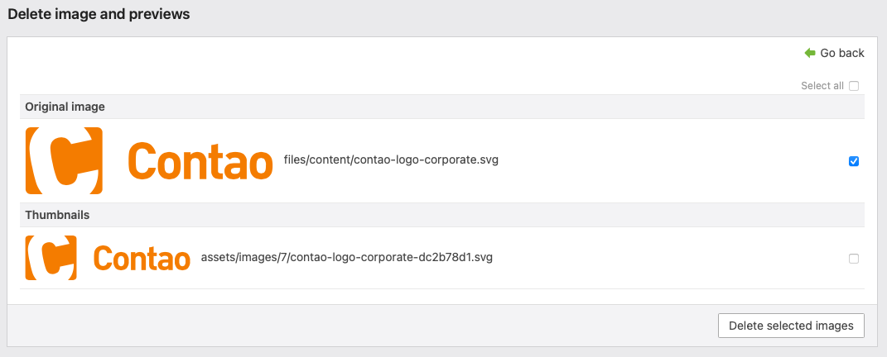

# terminal42/contao-image-delete

This Contao extension overrides the default behaviour when deleting an image
in the Contao back end file manager. When deleting an image, users will
be promted with a list of preview images that match the current file name.



This allows to _safely_ delete an image including it's preview, e.g.
if necessary for legal reasons.

**Attention:** be aware that the new dialog will **only** appear for image
files. The distinction is pretty simple: if you click the delete button,
a regular file will show the known dialog if you _really want to delete_
the file. For image files, this popup won't appear but the user will be
redirected to the _safe-delete_ form.


## Installation

Choose the installation method that matches your workflow!

### Installation via Contao Manager

Search for `terminal42/contao-image-delete` in the Contao Manager and add it to your installation. Finally, update the
packages.

### Manual installation

Add a composer dependency for this bundle. Therefore, change in the project root and run the following:

```bash
composer require terminal42/contao-image-delete
```

Depending on your environment, the command can differ, i.e. starting with `php composer.phar …` if you do not have
composer installed globally.


## License

This bundle is released under the [MIT](LICENSE)
